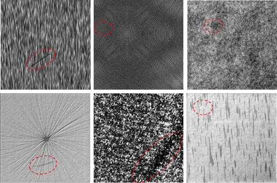
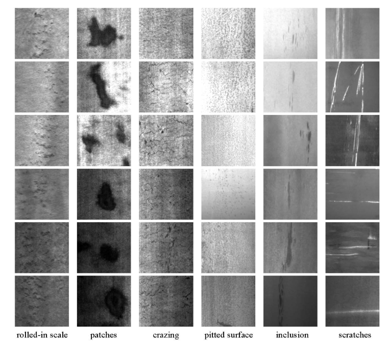
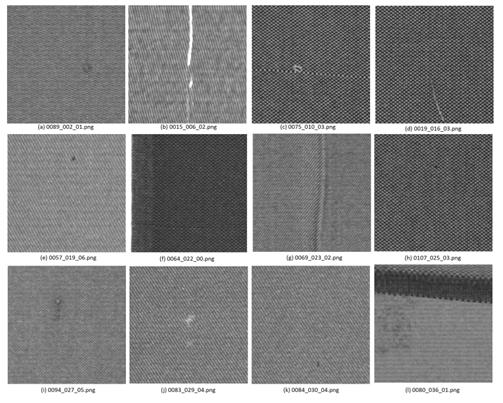
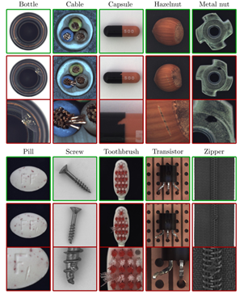
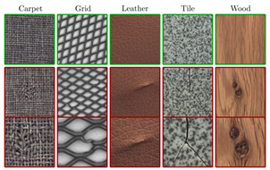

# Surface-defect-Detection-dataset
读研期间遇到的一些缺陷检测的图像，在此做一个表面缺陷数据集汇总，**感谢加星！**可从CSDN阅读：https://blog.csdn.net/qq_27871973/article/details/84974231。

**1、德国DAGM 2007的数据集**

总共十类图像，有训练集和测试集，部分样例如下：

数据官方网址：https://hci.iwr.uni-heidelberg.de/node/3616

网盘下载：

链接：https://pan.baidu.com/s/1CHrH1tZ-B6kvi8U7--isaw 
提取码：47jo 

**2、钢材表面缺陷**

这个数据集是东北大学一个老师收集的，分为三个数据集：

[NEU surface defect database](http://faculty.neu.edu.cn/yunhyan/NEU_surface_defect_database.html) 

[Micro surface defect database](http://faculty.neu.edu.cn/yunhyan/SCACM.html)

[Oil pollution defect database](http://faculty.neu.edu.cn/yunhyan/SLSM.html)

官方网址：http://faculty.neu.edu.cn/me/songkc/Vision-based_SIS_Steel.html ，数据官方网站中也给出了最近几年使用此数据集发表的paper。部分样例如下：

**3、KTH-TIPS database**

重复背景纹理数据集，样例图片如下，官方网址：http://www.nada.kth.se/cvap/databases/kth-tips/download.html

网盘下载链接：

数据集1：https://pan.baidu.com/s/173h8V66yRmtVo5rc2P7J4A

数据集2：https://pan.baidu.com/s/1dXFKn6v2PV5QS9m8gWlifA

**4、磁瓦缺陷的数据集**

 中科院自动化所一个课题组收集的数据，官方链接登录失败，只能从github链接：https://github.com/abin24/Magnetic-tile-defect-datasets. 该数据集总共包含**1344张图像**，对磁瓦的感兴趣区域 (ROI) 进行了裁剪。共包含6类图片 (5类缺陷，1类正常)。每张图像都做了pixel-level标注。

**5、铁轨表面缺陷数据集**

 数据集是北交大的李老师整理的，可以直接去主页：http://icn.bjtu.edu.cn/Visint/resources/RSDDs.aspx，里面有详细的类型介绍，注意使用时记得引用老师的论文！！！在主页尾部。样例如下（实际image是单个铁轨分开的）：

也可以直接网盘下载：链接：https://pan.baidu.com/s/185BhkZcz3x4qACw21vz_eQ 
提取码：6p3v 

**6、土木建筑表面裂纹检测数据**

数据集是github上的一个项目，主要是一些基建（水泥表面裂纹），可以访问：https://github.com/cuilimeng/CrackForest-dataset

或者链接：https://pan.baidu.com/s/1108j5QbDr7T3XQvDxAzVpg 
提取码：jajn 

另一个类似的数据集下载链接为：

链接：https://pan.baidu.com/s/1JzyxNqUBhbZmmgpIWoWXeg 
提取码：yvo8 

部分样例如下：

7、**铝型材表面瑕疵识别** 

数据集是天池比赛提供的，需要的可以去天池注册一个账号并下载。（比赛目前已经截至，数据就从网盘链接下载吧，好像解压需要密码，最近会把无需密码的数据包上传。）

链接：https://tianchi.aliyun.com/competition/entrance/231682/information

网盘下载链接：https://pan.baidu.com/s/1uUs-PmUcxeQ7qX_W-ohzMg

提取码：oxhn

**8、纺织品表面异常数据集**

天池比赛的数据，链接：https://tianchi.aliyun.com/competition/entrance/231666/information

网盘下载链接：https://pan.baidu.com/s/1wSddhzdfBp8kZcp8nIkzpg

提取码：hk5d

**9、Kylberg Texture Dataset v. 1.0**

数据样例如下，背景纹理种类蛮多。数据网址连接：http://www.cb.uu.se/~gustaf/texture/

**10、AITEX数据集**

数据官网：http://www.aitex.es/afid。该数据集包含7种织物图像，分辨率为4096x256。使用的时候可以自己裁剪成256x256大小。数据集提供了像素级标注。
 数据文献引用：Silvestre-Blanes, J., Albero-Albero, T., Miralles, I., Pérez-Llorens, R., & Moreno, J. (2019). A Public Fabric Database for Defect Detection Methods and Results. *Autex Research Journal*, *19*(4), 363-374.

网盘下载链接：https://pan.baidu.com/s/1pm-h4jGtIVfiosPwXOUkKA 
提取码：vgp0 

**11、MVTec 异常检测数据集 **

数据网站：http://www.mvtec.com/company/research/datasets

该数据集包含15个类别的物体和纹理共5K+张彩色图像。15个类别中涵盖了不同类型的规则纹理(地毯，格子)和随机纹理(皮革，瓷砖，木材)。除外还有：瓶子、金属螺母，电缆等。异常样本图像包含多种缺陷，缺陷是手工生成的。所有的图像分辨率都在700×700和1024×1024像素之间。该数据集并给出了ground truth。

